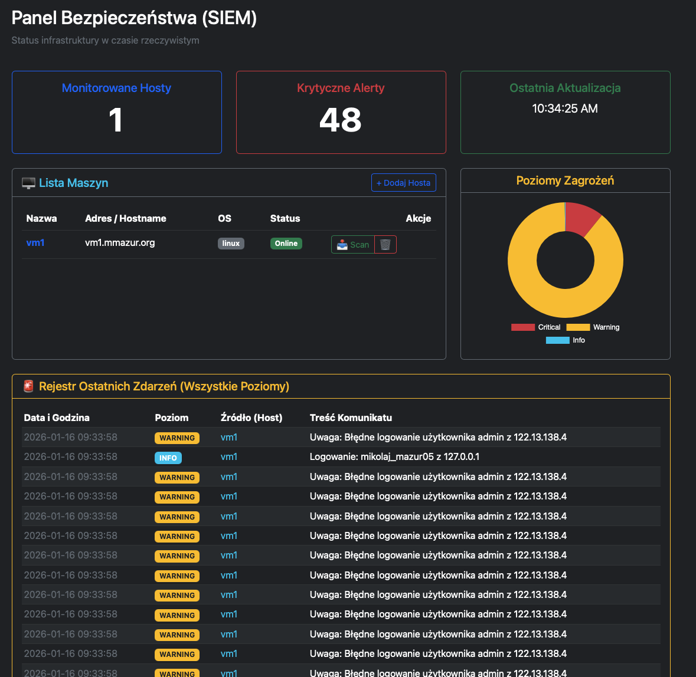

# mini-SIEM

A lightweight, custom Security Information and Event Management (SIEM) system designed for monitoring Linux SSH logs across remote environments using secure Cloudflare Tunnels.



## Architecture - (High-Level)

1. **SIEM Server**
   **WebUI Dashboard**: A Flask-based interface for real-time monitoring, threat visualization, and host management.
    - **Dockerized Environment**: The application runs in a containerized environment to ensure dependency isolation.
    - **Data Persistence**: 
        - **SQLite**: Stores host metadata, user states, and filtered security alerts.
        - **Parquet Archives**: Log data is stored in `.parquet` format for high-performance forensics and efficient disk usage.
    - **Environment**: Developed for deployment on local or cloud-based Docker hosts.

2. **Monitored Hosts**
    - **Cloudflared (Daemon)**: Installed on each target VM to create an outbound-only tunnel. This removes the need for ingress rules or open ports (like port 22) on the firewall.
    - **Log Source**: Utilizes `journalctl` to stream SSH service logs in JSON format for structured parsing.
    - **Target Environment**: Optimized for Linux distributions (Ubuntu/Debian) hosted on GCP or other cloud providers.

3. **Connectivity**
   - **SSH-over-HTTP**: Traffic is encapsulated in a Cloudflare Tunnel, secured by Cloudflare Access.
    - **Authentication**: Uses a dedicated SSH Private Key (`id_rsa_siem`) stored securely within the SIEM container.
    - **Zero Trust**: Access is controlled via Service Tokens or mTLS, ensuring only the SIEM Server can reach the monitored hosts.

## Project Structure

```
/MINI-SIEM
├── docker-compose.yml       # Container orchestration & volume mapping
├── Dockerfile               # SIEM Image definition (Python 3.x)
├── .env                     # Secrets (Flask keys, DB paths)
├── data/                    # Persistent Volume
│   ├── db.sqlite3           # Relational data (Alerts, Hosts)
│   ├── id_rsa_siem          # Dedicated SSH Private Key
│   └── archives/            # Historical log storage (.parquet files)
├── src/                     # Application Source Code
│   ├── app.py               # Flask application entrypoint
│   ├── extensions.py        # Database & Login managers
│   ├── models.py            # SQLAlchemy Database Models
│   ├── api/                 # Blueprints for Hosts and Alerts
│   │   ├── hosts.py         # Logic for fetching logs and managing VMs
│   │   └── alerts.py        # Alert statistics and history
│   └── core/                # Business Logic
│       ├── collector.py     # SSH connectivity & Journalctl fetching
│       ├── parser.py        # Regex logic & ANSI text cleaning
│       └── data_manager.py  # Parquet read/write operations
└── requirements.txt         # Dependencies (Paramiko, Pandas, Pyarrow, Flask)
```

## Remote host setup

1. **Remote Host Configuration**

On every monitored VM, the SIEM user must have permissions to read logs and manage the firewall without a password prompt. 
Add the following to `visudo`:
```
mikolaj_mazur05 ALL=(ALL) NOPASSWD: /usr/sbin/iptables, /usr/bin/journalctl
```

3. **Cloudflare Tunnel**

Ensure cloudflared is running on the host and the Public Hostname is configured in the Cloudflare Zero Trust dashboard (e.g., `vm1.yourdomain.com`).

4. **SIEM placement**

    1. set `.env`
    ```
    # Token for tunneling WebUI
    CLOUDFLARE_TUNNEL_TOKEN= 
    # Deafult panel admin username
    ADMIN_USER= 
    # Deafult panel admin password
    ADMIN_PASSWORD=
    ```
    2. Place your private key in `data/id_rsa_siem`
    3. Transport public key generated based on `id_rsa_siem` to `.ssh/allowed_hosts` on client
    4. Set appropriate permissions: `chmod 600 data/id_rsa_siem`
    5. Build, run and init db on server:
    ```
    docker compose up -d --build
    docker compose exec app flask setup
    ```
